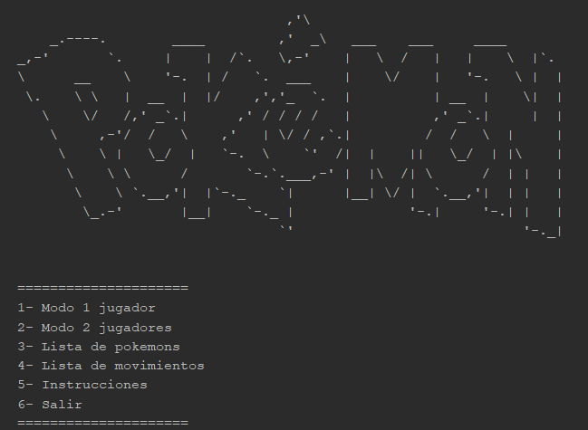
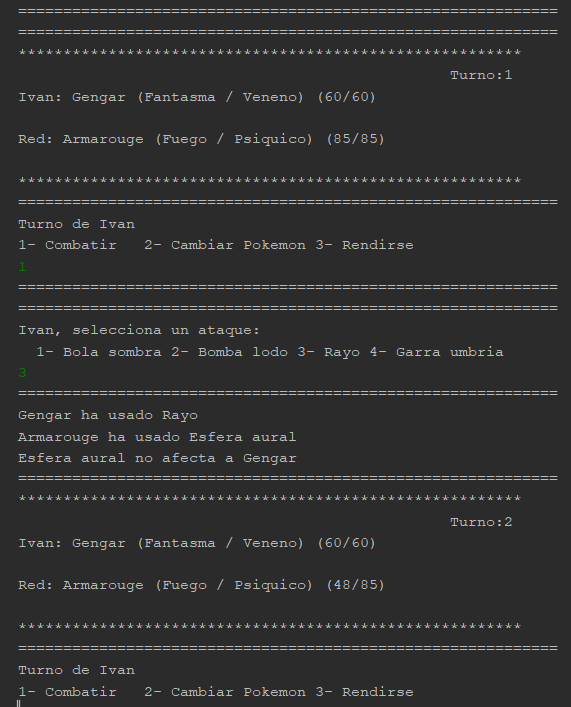

# ⚔️ Combate Pokémon en Línea de Comandos

Bienvenido al repositorio de **Combate Pokémon**, un juego de estrategia por turnos en el que podrás enfrentar a tus Pokémon contra los de entrenadores rivales. El juego está desarrollado en **Java**, con música integrada y objetos como entrenadores, Pokémon, y movimientos guardados en ficheros externos que el programa lee al ejecutarse.

## 🎮 Descripción del Juego

En este juego de combates por turnos, deberás elegir **3 Pokémon** para enfrentarte a un rival. Durante el combate, podrás elegir entre tres acciones en cada turno:

- **Atacar**: Selecciona uno de los 4 ataques de tu Pokémon para atacar al rival.
- **Cambiar de Pokémon**: Cambia tu Pokémon activo por uno de los otros dos de tu equipo.
- **Rendirse**: Termina el combate rindiéndote.

### 🌟 Tipos y Sinergias Elementales

Cada Pokémon tiene **2 tipos elementales** y cada ataque pertenece a un **tipo elemental**. Las sinergias entre tipos afectan al daño de los ataques:

- Si el ataque coincide con uno de los tipos del Pokémon atacante, causa **1.5x más daño**.
- La efectividad del ataque depende de los tipos del Pokémon rival:
  - Un ataque de **tipo agua** causa **2x daño** a un Pokémon de **tipo fuego**.
  - Un ataque de **tipo agua** causa **0.5x daño** a un Pokémon de **tipo planta**.

¡Planifica bien tus movimientos y usa las sinergias a tu favor para ganar el combate!

## 🖥️ Vistas del Juego

### Menú Principal
Aquí podrás acceder al combate o gestionar las opciones del juego.



### Pantalla de Combate
Elige tus acciones en un combate por turnos, donde podrás atacar, cambiar de Pokémon o rendirte.



## 🗂️ Estructura del Proyecto

El proyecto sigue una estructura basada en la lectura de objetos externos para definir entrenadores, Pokémon y movimientos. Estos ficheros son procesados por el programa para crear las dinámicas del juego.

- **Entrenadores y Pokémon**: Guardados en ficheros externos, permitiendo personalizar los personajes.
- **Movimientos**: Definidos también en ficheros externos, lo que permite añadir nuevos ataques o modificarlos sin alterar el código fuente.
- **Música**: El juego incluye música integrada para mejorar la experiencia de juego.

## 🚀 Instalación

Sigue los siguientes pasos para ejecutar el juego en tu máquina:

1. Clona este repositorio:

   ```bash
   git clone https://github.com/ivan2porta/ProyectoPokemon.git
